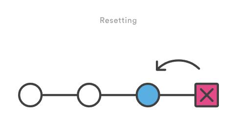
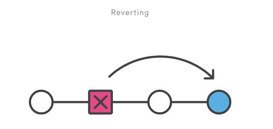

# Git相关
[TOC]

## 基本流程
### 查看历史
* 显示每次提交的内容差异 `git log -p -2`
* 显示每次提交的简略统计信息 `git log --stat`
* 使用不同于默认的格式显示提交历史(oneline, short, full, fuller或使用format定制) `git log --pretty=oneline`
>[format参数](#formatParameter) 
[git log常见参数](#logParameter) 
[git log输出控制](#logOutputControl)
* 图示显示提交历史 `git log --graph --pretty=oneline --abbrev-commit`
### 解决冲突

## 文件状态
>
status|meaning
-------|-------
已暂存(staged)|对这个被暂存，并把暂存放到下次要提交的清单
已修改(modified)|已被修改，但还没被提交，没有做暂存
已提交(commited)|已安全的保存在本地数据库
### 查看分支状态
当前状态 `git status` 
历史记录 `git log` 
每个分支最后的提交 `git branch -v` 
显示本地仓库的引用日志`git reflog`
### 标签
创建标签|code
--------|----
为当前分支最后一次提交创建标签，标签无法重命名|git tag 1.0
为contacts分支最近一次提交创建标签|git tag contacts_1.1 contacts
为某次历史提交创建标签|git tag 1.1 4e6861d5
显示标签列表|git tag
检出标签，查看标签断面很方便|git checkout 1.0
由标签创建分支|git branch b1.1 1.1 git checkout -b b1.0 1.0
删除标签|git tag -d 1.0
导出版本库|git archive --format=zip HEAD>nb.zip git archive --format=zip --prefix=nb1.0/ HEAD>nb.zip
推送标签信息|git push origin --tags
推送特定标签|git push origin tagname(v1.0.0)
删除标签|git tag -d tag-name
删除远程标签|git push origin --delete tag tag-name

## 分支管理
### 1\.创建分支 
* 创建本地分支 `git branch local_branch`
* 重命名当前分支 `git branch -m <branch>`
* 分支切换 `git checkout local_branch`
* **可简写为**`git checkout -b local_branch`
### 2\.本地分支与远程分支
* 抓取远程分支到本地 `git checkout -b local_branch origin/remote_branch`
* 关联本地与远程分支 `git branch --set-upstream local_branch origin/remote_branch`
* 查看本地分支对应的远程分支 `git branch -vv`
* 远程分支已创建并与本地分支建立联系，在分支上推送 `git push`
* 远程分支已创建并未关联本地分支，在分支上推送 `git push -u origin/remote_branch` 仅关联的话可： `git branch -u origin/remote_branch`
* 远程分支没有创建分支，在分支上推送(同名话':'之后可省略) `git push origin local_branch:remote_branch`
* 创建新的远程库链接`git remote add <name> <url>`
* 重定向远程库链接(Fork工作方式设定上有仓库远程连接为`upstream url`)`git remote set-url <name> <url>`
* 重命名远程连接`git remote rename <old-name> <new-name>`
* 移除远程库的链接`git remote rm <name>`
### 3\.查看分支状态
* 查看本地分支 &emsp; `git branch`
* 查看远程库信息 `git ls-remote` 或`git remote (-v 查看权限)/show remote_branch`
* 查看本地分支对应远程分支 `git branch -vv`
* 查看所有分支 &emsp;`git branch -a`
### 4\.重命名分支
* 若newbranch名字分支已存在，则需要-M强制重命名(不建议) `git branch -m|-M oldbranch newbranch`
### 5\.删除分支
* 删除本地分支 `git branch -d (-force) local_branch`
* 强制删除本地分支 `git branch -D <branch>`
* 删除远程分支 `git push origin --delete remote_branch` 或`git push origin :remote_branch`
### 6\.获取远程库信息
* 拉取远程库所有分支，但不合并进本地库`git fetch <remote>`
* 拉取远程库指定分支`git fetch <remote> <branch>`
* 将远程库拉取并合并`git pull <remote>`等价于`git fetch`+`git merge`
* 将远程库拉取并利用rebase合并`git pull --rebase <remote>`

## 滚回修改

### 1\.checkout方法
* 查看之前状态`git checkout <logHASH>`
* 查看之前某文件的状态`git checkout <logHASH> <fileName>`
* 回到当前状态`git checkout master`
* 回到当前状态`git checkout HEAD <fileName>`

### 2\.revert方法
>撤销已提交的快照(生成新的提交在所在分支)

* 撤销某已提交的快照，并应用到当前分支`git revert <commit>`

### 3\.reset方法
>移除提交，回到之前的状态，只能针对当前回溯

* 常用语撤销缓存区和工作目录的修改（只能用于本地修改，**不可恢复**）
* 从缓存器移除特定文件，但不改变工作目录`git reset <file>`
* 重设缓冲区，但不改变工作目录，取消左右文件的缓存，但不会覆盖任何修改`git reset`
* 重设缓冲区和工作目录，匹配最近一次提交`git reset --hard`
* 将当前分支末端移动到`<commit>`但不改变工作目录，`<commit>`之后的更改会保留在工作目录中 `git reset <commit>`
* 清楚了`<commit>`之后所有的提交  `git reset --hard <commit>`

### 4\.删除未跟踪的文件`clean`
* 显示将被删除的文件`git clean -n`
* 移除当前目录下未被跟踪的文件`git clean -f`
* 移除限制在某个路径下`git clean -f <path>`
* 移除未被追踪的本地文件及目录`git clean -df`
* 移除中包含一般忽略的文件`git clean -xf`
## 小技巧
### 1\.修改错误的提交信息
* 编辑最近的一次提交（未推送） `git commit --amend`
* 提交了，发现提交信息写错了，修改上次提交的信息可以用这条命令  `git commit --amend -m "new commit message"`
* 同上，但不需要修改上次提交的信息 `git commit --amend --no-edit`
* 若已退送，则需要强制推送提交以覆盖（慎用） `git push <remote> <branch> --force`
* 不会产生新的提交历史记录，复用HEAD留言，增补提交，而不增加提交记录  `git commit -C HEAD -a --amend`
### 2\.提交前撤销git add
* 往暂存区(staging area)中加入错误文件 移除一个文件 `git reset <file_name>` 移除所有未提交的文件 `git reset`
### 3\.撤销合并
&emsp;&emsp;`git checkout -b <SHA>`
### 4\.移除未被追踪的本地文件 
* 显示会被移除的文件 `git clean -f -n`
* 移除文件 `git clean -f`
### 5\.合并多个Commit
>1. 首先查看现有的commit &emsp;&emsp;&emsp;&emsp; `git log --oneline`
>2. 找到不需要合并的最近的commit `git rebase -i hash`
>3. 将需要合并的commit前指改为 &emsp; `squash`
>>如操作中有失误，撤销用 `git rebase --abort`
### 6\.停止跟踪某文件-不删除
`git rm –cached file_name`

  

## format参数
选项  | 说明
:-- | :-------------------------
%H  | 提交对象（commit）的完整哈希字串
%h  | 提交对象的简短哈希字串
%T  | 树对象（tree）的完整哈希字串
%t  | 树对象的简短哈希字串
%P  | 父对象（parent）的完整哈希字串
%p  | 父对象的简短哈希字串
%an | 作者（author）的名字
%ae | 作者的电子邮件地址
%ad | 作者修订日期（可以用 --date= 选项定制格式）
%ar | 作者修订日期，按多久以前的方式显示
%cn | 提交者(committer)的名字
%ce | 提交者的电子邮件地址
%cd | 提交日期
%cr | 提交日期，按多久以前的方式显示
%s  | 提交说明

### git log 的常用选项

选项              | 说明
:-------------- | :-----------------------------------------------------------------
-p              | 按补丁格式显示每个更新之间的差异。
--stat          | 显示每次更新的文件修改统计信息。
--shortstat     | 只显示 --stat 中最后的行数修改添加移除统计。
--name-only     | 仅在提交信息后显示已修改的文件清单。
--name-status   | 显示新增、修改、删除的文件清单。
--abbrev-commit | 仅显示 SHA-1 的前几个字符，而非所有的 40 个字符。
--relative-date | 使用较短的相对时间显示（比如，"2 weeks ago"）。
--graph         | 显示 ASCII 图形表示的分支合并历史。
--pretty        | 使用其他格式显示历史提交信息。可用的选项包括 oneline，short，full，fuller 和 format（后跟指定格式）。

## 限制 git log 输出的选项
选项                | 说明
:---------------- | :----------------
-(n)              | 仅显示最近的 n 条提交
--since, --after  | 仅显示指定时间之后的提交。
--until, --before | 仅显示指定时间之前的提交。
--author          | 仅显示指定作者相关的提交。
--committer       | 仅显示指定提交者相关的提交。
--grep            | 仅显示含指定关键字的提交
-S                | 仅显示添加或移除了某个关键字的提交

