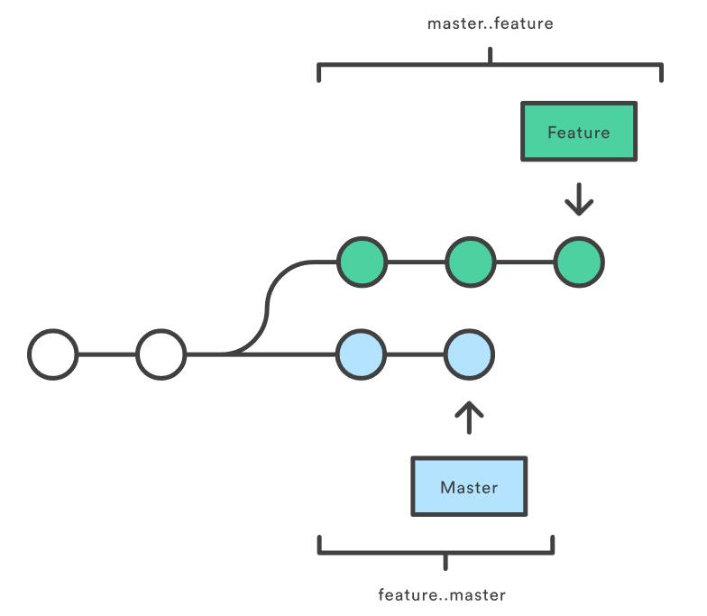

# git log
>by my88899  
这是一篇在原文([BY 童仲毅](https://github.com/geeeeeeeeek/git-recipes/wiki/5.3-Git-log%E9%AB%98%E7%BA%A7%E7%94%A8%E6%B3%95))基础上的学习笔记。除非另行注明，页面上所有内容采用知识共享-署名([CC BY 2.5 AU](http://creativecommons.org/licenses/by/2.5/au/deed.zh))协议共享。

## 格式化log输出
* Oneline
>--oneline标记把每个提交压缩到一行，默认只显示ID和提交信息
* Decorate
>--decorate让log显示指向这个提交的所有引用(例如分支、标签等)
* Diff
>最常用显示两个提交间的差异的是`--stat`和`-p`
>>`--stat`：显示每次提交文件的增删数量(简略、直观)  
`-p`显示每次提交删改的绝对数量(所有改动都会输出)
* Shortlog
>`git shortlog`为创建发布声明设计，把提交按作者分类
* Graph
>`--grah`绘制一个ASCII图像来展示提交历史的分支结构。常与`--oneline`和`--decorate`连用
## 自定义格式
**`--pretty=format:"<string>"`**
允许使用像printf一样的占位符里输出提交记录。
>例如`%cn`、`%h`和`%cd`分别会被替换为作者名字、缩略标识和提交日期。  
更详细内容可以查看*git log*文档中[Pretty Formats](https://www.kernel.org/pub/software/scm/git/docs/git-log.html#_pretty_formats)部分。
## 过滤提交历史
* 按数量: `-<n>`从最近开始到第n次提交
* 按日期: `--after`或`--before`按日期来筛选，例如`--after="2017-6-1"`;相对日期，例如："`yesterday`"、"`1 week ago`"均可用
* 按作者: `--author="<name>"`作者名为子串匹配(注：邮箱也算做作者名)
* 按体检信息: `--grep`类似作者名，搜索范围是提交信息，`-i`忽略大小写
* 按文件: `--`例如`git log -- foo.py bar.py`返回这两个文件相关的提交，`--`是为了告知其后参数是文件路径
* 按内容: `-S "<string>"`; 若需要使用正则表达式则可使用`-G "<regex>"`
* 按范围: `<since>..<until>`常用于显示两分支之间区别，例如`git log master..feature`范围内包含在feature分支而不在master分支的提交
* 过滤合并提交: `--no-merges`(若只对合并提交感兴趣，则`--merges`)

