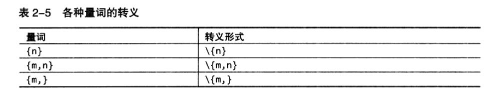

#正则表达式-基础内容
[TOC]

##基础定义
标记|含义
----|----
.|任意字符(除\n)
[\d\D]等|任意字符
\d|[0-9]
\w|[0-9a-zA-Z]
\s|[ \t\r\n\v\f]
\D\W\S|对应排除型减记法
[^]|排除型字符组
&&|JAVA中和[^]同用表减去
&vert;|"()"内表选择、或结构
^|行起始位置
$|行结束位置
\b|单词边界 断言

##量词
一般跟在要进行数量匹配标志后
>
标记|含义
----|----
{n}|n个
{m,n}|最少m，最多n个。可缺省
*|{0,}
+|{1,}
?|{0,1}

1. 优先量词：又称"贪婪量词"，及尽可能的匹配，不匹配后回溯

* 忽略优先量词：又称"懒惰量词"，先测试正则表达式后面的元素，失败后再退回来尝试([\s\S]*?)
	1. 匹配第一个成立的

##括号
###分组
* "()"按顺序在之后用\1\2代表
###引用
####引用分组
* 默认存在编号为0的分组
* 分组编号只取决于开括号出现的顺序 

####反向引用
* 针对叠字检测，之前匹配结果未知的情况

	* ps：用"\g<n>"消除引用后跟数字带来的二义性
####重命名分组
* Python中采用"(?P<name>...)"来重命名分组
* 各语言的重命名分组

####非捕获分组 --- 提高效率
* 只用于限定量词范围，不捕获文本，在计算分组编号时跳过

####各种引用记法

##断言
* 不真正匹配文本，只负责判断在某个位置左/右侧的文本是否符合要求的结构
###单词边界
>单词边界标识符：\b 
非单词边界标识符：\B
###行起始/结束位置
>字符串/行起始位置：^ 
>>字符串起始位置：\A 
>
>字符串/行结束位置：$ 
>>字符串结束位置：\Z

###环视

##匹配模式

##其他知识点
###POSIX字符组

###转义
* 字符串中有特定意义的字符，但不做特定字符解释

##常用匹配
###各类tag的匹配

